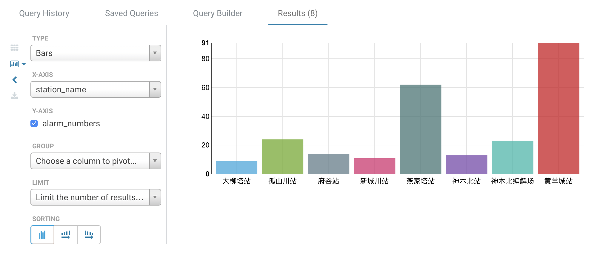
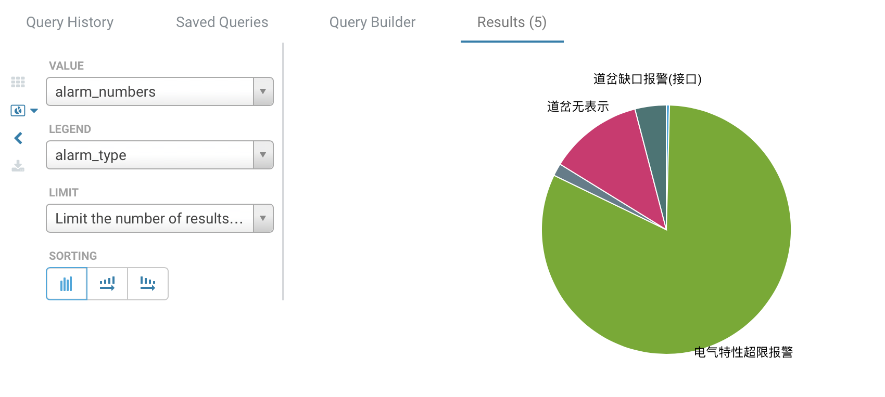
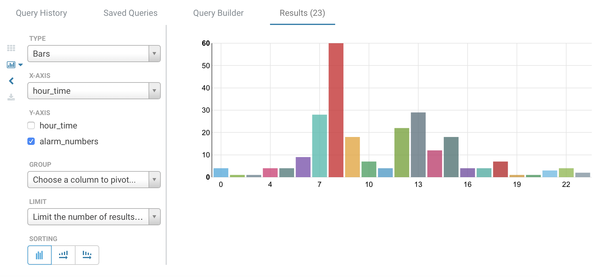

# DataCenterUtils
## DFSVideoManager
HDFS+HBASE video management

执行前客户端需在/etc/hosts添加 server ip ceph-0 如 202.120.38.100 ceph-0

## mysql导入HIVE

创建同结构的hive表
```bash
hive> CREATE TABLE train (
  id int,
  train string,
  weight int,
  goods int,
  start_station int,
  end_station int,
  train_time timestamp,
  year int,
  month int,
  day int)
ROW FORMAT DELIMITED FIELDS TERMINATED BY ',' STORED AS TEXTFILE;
```

sqoop导入
```bash
$ sqoop import \
--connect jdbc:mysql://localhost:3306/hue_pre \
--username hue -P \
--table train_test2 \
--fields-terminated-by ',' \
--delete-target-dir \
--num-mappers 1 \
--hive-import \
--hive-database test1 \
--hive-table train
```
注意sqoop命令中的分隔符应与HIVE建表时设定的分隔符相一致

## csv导入HIVE

先在HIVE中创建临时表train_raw以进行后续的日期处理
```bash
hive> CREATE TABLE train_raw (
  train string,
  weight string,
  goods string,
  start_station string,
  end_station string,
  year string,
  month string,
  day string)
ROW FORMAT DELIMITED FIELDS TERMINATED BY ',' STORED AS TEXTFILE;
```

使用LOAD命令将csv数据导入临时表
```bash
hive> LOAD DATA local INPATH '/home/hadoop/DBGenerator/train_100.csv' into table test1.train_raw;
```

使用LOAD命令将hdfs中的csv数据导入的命令为
```bash
hive> LOAD DATA INPATH '/user/1219test/train_100.csv' into table test1.train_raw;
```

创建sql脚本transform.sql处理日期格式，进行导入（已放入131相应目录）
```bash
-- transform.sql
-- hive无自增主键功能，此处先把id设为0
insert into train select
    0,
    train,
    weight,
    goods,
    start_station,
    end_station,
    cast (concat(substr(year, 2), '-', substr(month, 2), '-', substr(day, 2), ' 00:00:00') as timestamp),
    year,
    month,
    day
from train_raw;
```

执行脚本
```bash
hive> source /home/hadoop/DBGenerator/transform.sql;
```

## 每日报警数据分析(hue)
创建hive表，Excel表中有逗号内容，所以分隔符改为；
```bash
hive> CREATE TABLE daily_alarm (
  id int,
  station_name string,
  device_name string,
  alarm_number int,
  alarm_type string,
  alarm_level string,
  alarm_time timestamp,
  recover_time timestamp,
  is_solved string,
  alarm_information string,
  solve_staff string,
  solve_result string,
  solve_time timestamp)
ROW FORMAT DELIMITED FIELDS TERMINATED BY ';' STORED AS TEXTFILE;
```

python脚本将Excel转为csv，并去掉表头，设置;分隔符
```
import pandas as pd
excel_file = '9.20每日报警汇总表'
data = pd.read_excel(excel_file+'.xls','Sheet1',index_row=0)
data.to_csv(excel_file+'.csv', encoding='utf-8', sep=';', header=None)
```

hive导入
```
hive> load data local inpath '/home/nieliangxu/9.20每日报警汇总表.csv' into table test1.daily_alarm;
```

- 不同车站报警对比
```
hive> select station_name, sum(alarm_number) as alarm_numbers from test1.daily_alarm group by station_name;

```

- 不同报警类型对比
```
select alarm_type, alarm_level, sum(alarm_number) as alarm_numbers from test1.daily_alarm group by alarm_type, alarm_level;

```


- 一天24小时不同时段报警对比
```
select hour_time, sum(alarm_number) as alarm_numbers from (select cast(date_format(alarm_time, 'H') as int) as hour_time, alarm_number FROM test1.daily_alarm) sub_query 
group by hour_time order by hour_time;
```


为加快展示速度，将结果提前存入临时表中，使用hue中以下三个saved query创建结果临时表

- Create table for result of query by station
- Create table for result of query by alarm type and level
- Create table for result of query by hour

已经创建表后，使用以下三个saved query查看结果

- Query alarm by station
- Query alarm by alarm type and level
- Query alarm by hour in one day